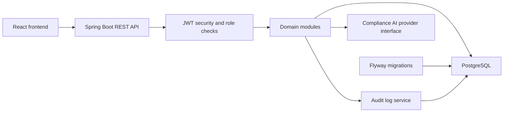

# ComplyAI

## Project Overview

ComplyAI is a multi-tenant compliance operations application for managing privacy-oriented workflows in a structured workspace. It helps teams track personal-data inventory, consent records, data subject requests, audit activity, compliance dashboard metrics, and AI-assisted risk review.

The system is implemented as a modular monolith: one deployable backend with clear package boundaries, a React frontend, PostgreSQL persistence, Flyway migrations, and a deterministic mock AI provider that can be replaced by a real provider later.

Key capabilities:

- Tenant-aware authentication and role-based authorization.
- Personal data inventory management.
- Consent record tracking and status visibility.
- Data subject request assignment, workflow transitions, and audit trail.
- Tenant-scoped dashboard metrics.
- Central audit logging for sensitive actions.
- Mock-first AI compliance analysis behind a provider interface.
- Dockerized local environment for backend, frontend, and database.

## Architecture



End-to-end pipeline:

1. Users authenticate through the backend and receive a JWT.
2. The frontend sends tenant-scoped API requests with the token.
3. Spring Security validates identity, roles, and access boundaries.
4. Domain services apply workflow rules for inventory, consent, requests, users, tenants, dashboards, and AI scans.
5. JPA repositories persist state to PostgreSQL.
6. Flyway maintains schema and seed data.
7. Audit logging records important actions for traceability.

## Tech Stack

| Layer | Technology | Purpose |
|---|---|---|
| Frontend | React, TypeScript, Vite, React Router, React Query, Axios, Material UI | Browser application and API client |
| Backend | Java 21, Spring Boot, Spring Web, Spring Security, Spring Data JPA | REST API, domain services, authentication, persistence |
| Database | PostgreSQL, Flyway | Durable storage and schema migrations |
| AI boundary | Provider interface with mock implementation | Repeatable compliance analysis without external API dependencies |
| DevOps | Docker, Docker Compose, GitHub Actions | Local runtime and CI |
| Testing | JUnit 5, Mockito, Testcontainers, Vitest, React Testing Library | Backend, integration, and frontend regression coverage |

## Data Flow

1. Ingestion: users enter inventory, consent, request, tenant, user, and AI-scan data through the React UI or REST API.
2. Processing: backend controllers validate payloads and delegate to services for tenant access checks, workflow rules, and business validation.
3. Storage: JPA repositories persist normalized domain entities in PostgreSQL.
4. Transformation: dashboard and compliance services aggregate operational metrics, risk indicators, and recent activity.
5. Serving: REST endpoints return DTOs to the frontend for tables, forms, dashboards, and detail views.

## Setup Instructions

### Prerequisites

- Java 21
- Node.js 20 or later
- Docker Desktop
- Git

### Environment Variables

Copy the example environment file before running locally:

```bash
cp .env.example .env
```

Important variables:

| Variable | Purpose |
|---|---|
| `DB_URL` | JDBC URL for PostgreSQL |
| `DB_USERNAME` | Database username |
| `DB_PASSWORD` | Database password |
| `JWT_SECRET` | Secret used to sign access tokens |
| `JWT_EXPIRY_MINUTES` | Access-token lifetime |
| `CORS_ORIGINS` | Allowed frontend origins |
| `AI_MODE` | AI provider mode; currently `mock` |
| `VITE_API_BASE_URL` | Frontend API base URL |

### Docker Setup

Run the full stack:

```powershell
docker compose -f .\infra\docker-compose.yml up --build
```

Local URLs:

- Frontend: `http://localhost:8081`
- Backend API: `http://localhost:8080`
- Swagger UI: `http://localhost:8080/swagger-ui.html`
- Health: `http://localhost:8080/actuator/health`

### Local Run Steps

Start PostgreSQL with Docker or an equivalent local instance.

Run the backend:

```powershell
cd backend
.\mvnw.cmd spring-boot:run
```

Run the frontend:

```powershell
cd frontend
npm install
npm run dev
```

## Project Structure

```text
.
|-- backend/
|   |-- src/main/java/com/complyai/
|   |   |-- ai/                  # AI analysis boundary and persistence
|   |   |-- audit/               # Audit log controller, service, repository
|   |   |-- auth/                # Login and token issuance
|   |   |-- common/              # Shared DTOs, enums, exceptions, utilities
|   |   |-- config/              # Spring, OpenAPI, JPA, and web config
|   |   |-- consent/             # Consent record workflow
|   |   |-- dashboard/           # Aggregated compliance metrics
|   |   |-- inventory/           # Personal data inventory records
|   |   |-- request/             # Data subject request workflow
|   |   |-- security/            # JWT filter, principal, access utilities
|   |   |-- tenant/              # Tenant access evaluation
|   |   |-- tenantmanagement/    # Tenant administration
|   |   |-- user/                # User and role management
|   |-- src/main/resources/db/migration/ # Flyway migrations and demo seed data
|   |-- src/test/               # Unit and integration tests
|-- frontend/
|   |-- src/api/                # Axios client and service wrappers
|   |-- src/components/         # Shared UI components
|   |-- src/features/           # Page-level product features
|   |-- src/layouts/            # Application shell
|   |-- src/routes/             # Auth and role route guards
|-- docs/                       # Architecture, API, deployment, testing, and security notes
|-- infra/                      # Docker Compose and Nginx config
|-- scripts/                    # Local helper scripts and seed notes
```

## Key Components

### ETL Pipeline

ComplyAI does not use a traditional batch ETL process. Its operational ingestion is API-driven: user actions create and update normalized domain records that are immediately available to dashboard and audit views.

### Streaming Pipeline

No message broker is currently included. Audit logs provide an append-only event record that can later feed notifications, async processing, or analytics exports.

### dbt Models

No dbt project is present. If analytical reporting becomes a requirement, PostgreSQL tables for inventory, consent, requests, tenants, users, AI analysis, and audit logs can be modeled downstream in dbt.

### API Layer

The API is organized by feature under `/api/v1/**`. Controllers expose DTO-first contracts, services enforce workflow and tenant rules, repositories handle persistence, and `GlobalExceptionHandler` standardizes API errors.

### Data Quality Checks

Data quality is enforced with validation annotations, service-level workflow rules, tenant access checks, Flyway constraints, and automated tests. The request workflow also centralizes allowed status transitions in `RequestWorkflowRules`.

## Testing

Backend tests:

```powershell
cd backend
.\mvnw.cmd test
```

Frontend tests and build:

```powershell
cd frontend
npm install
npm run test
npm run build
```

The CI workflow runs backend and frontend checks to catch regressions in domain rules, integration flows, route guards, and UI behavior.

## Troubleshooting

| Issue | Fix |
|---|---|
| Backend cannot connect to PostgreSQL | Check `DB_URL`, `DB_USERNAME`, `DB_PASSWORD`, and confirm Docker is running |
| Flyway migration fails | Do not edit applied migrations; add a new migration for schema changes |
| Login succeeds but API calls fail | Verify `JWT_SECRET` and token expiry settings |
| Frontend cannot reach the API | Check `VITE_API_BASE_URL` and `CORS_ORIGINS` |
| Docker frontend runs but backend is unhealthy | Inspect backend logs with `docker compose -f .\infra\docker-compose.yml logs backend` |
| Testcontainers tests fail | Ensure Docker Desktop is running and accessible |

## Future Improvements

- Add refresh-token rotation and password reset workflows.
- Add invitation and onboarding emails.
- Add file attachment storage for evidence documents.
- Replace mock AI with a versioned provider integration.
- Add notification events for request assignments and due dates.
- Add reporting exports for audits and compliance reviews.
- Introduce a downstream analytics layer for tenant-level trend reporting.

## Compliance Disclaimer

ComplyAI is a technical compliance-support system. It is not legal or regulatory advice.
